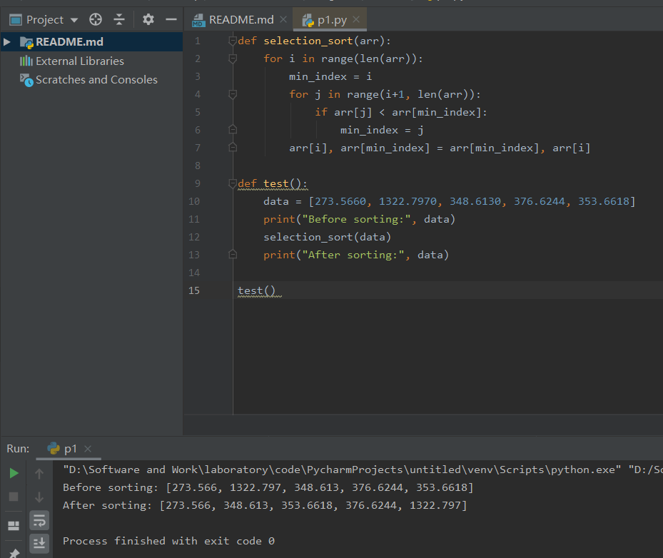
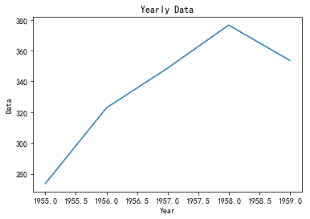

# Exp3 Jupyter Notebook实践

##实验内容——Notebook基本概念
在 Jupyter Notebook 中，使用单元格时可以使用两种模式：编辑模式和命令模式。编辑模式由绿色单元格边框表示，允许编辑单元格的内容，而命令模式由蓝色单元格边框表示，允许对单元格执行各种操作，例如创建或删除它们。
Jupyter Notebook 中的内核是指运行代码并存储结果的计算引擎。运行一个单元时，该单元中的代码被发送到内核执行，并且任何输出都返回到该单元。内核还会跟踪会话期间定义的任何变量或函数，以便以后可以重用它们。

##实验内容——熟悉基本的Python语法

##实验内容——数据分析
```python
import numpy as np
import pandas as pd
import matplotlib.pyplot as plt
import matplotlib.pyplot as plt
plt.rcParams['font.sans-serif'] = ['SimHei']
plt.rcParams['axes.unicode_minus'] = False
%matplotlib inline
```


```python
#获取数据
df = pd.read_csv('D:/Software and Work/temp/软件研发实践3/fortune500.csv')
df.head()
df.info()
```

    <class 'pandas.core.frame.DataFrame'>
    RangeIndex: 25500 entries, 0 to 25499
    Data columns (total 5 columns):
     #   Column                 Non-Null Count  Dtype  
    ---  ------                 --------------  -----  
     0   Year                   25500 non-null  int64  
     1   Rank                   25500 non-null  int64  
     2   Company                25500 non-null  object 
     3   Revenue (in millions)  25500 non-null  float64
     4   Profit (in millions)   25500 non-null  object 
    dtypes: float64(1), int64(2), object(2)
    memory usage: 996.2+ KB
    


```python
df_filtered = df[df['Year'] > 2004]
df_filtered.head()
```


<div>
<style scoped>
    .dataframe tbody tr th:only-of-type {
        vertical-align: middle;
    }

    .dataframe tbody tr th {
        vertical-align: top;
    }

    .dataframe thead th {
        text-align: right;
    }
</style>
<table border="1" class="dataframe">
  <thead>
    <tr style="text-align: right;">
      <th></th>
      <th>Year</th>
      <th>Rank</th>
      <th>Company</th>
      <th>Revenue (in millions)</th>
      <th>Profit (in millions)</th>
    </tr>
  </thead>
  <tbody>
    <tr>
      <th>25000</th>
      <td>2005</td>
      <td>1</td>
      <td>Wal-Mart Stores</td>
      <td>288189.0</td>
      <td>10267</td>
    </tr>
    <tr>
      <th>25001</th>
      <td>2005</td>
      <td>2</td>
      <td>Exxon Mobil</td>
      <td>270772.0</td>
      <td>25330</td>
    </tr>
    <tr>
      <th>25002</th>
      <td>2005</td>
      <td>3</td>
      <td>General Motors</td>
      <td>193517.0</td>
      <td>2805</td>
    </tr>
    <tr>
      <th>25003</th>
      <td>2005</td>
      <td>4</td>
      <td>Ford Motor</td>
      <td>172233.0</td>
      <td>3487</td>
    </tr>
    <tr>
      <th>25004</th>
      <td>2005</td>
      <td>5</td>
      <td>General Electric</td>
      <td>152363.0</td>
      <td>16593</td>
    </tr>
  </tbody>
</table>
</div>


```python
df_sorted = df.sort_values(by='Revenue (in millions)', ascending=False)
df_sorted.head()
```


<div>
<style scoped>
    .dataframe tbody tr th:only-of-type {
        vertical-align: middle;
    }

    .dataframe tbody tr th {
        vertical-align: top;
    }

    .dataframe thead th {
        text-align: right;
    }
</style>
<table border="1" class="dataframe">
  <thead>
    <tr style="text-align: right;">
      <th></th>
      <th>Year</th>
      <th>Rank</th>
      <th>Company</th>
      <th>Revenue (in millions)</th>
      <th>Profit (in millions)</th>
    </tr>
  </thead>
  <tbody>
    <tr>
      <th>25000</th>
      <td>2005</td>
      <td>1</td>
      <td>Wal-Mart Stores</td>
      <td>288189.0</td>
      <td>10267</td>
    </tr>
    <tr>
      <th>25001</th>
      <td>2005</td>
      <td>2</td>
      <td>Exxon Mobil</td>
      <td>270772.0</td>
      <td>25330</td>
    </tr>
    <tr>
      <th>24500</th>
      <td>2004</td>
      <td>1</td>
      <td>Wal-Mart Stores</td>
      <td>258681.0</td>
      <td>9054</td>
    </tr>
    <tr>
      <th>24000</th>
      <td>2003</td>
      <td>1</td>
      <td>Wal-Mart Stores</td>
      <td>246525.0</td>
      <td>8039</td>
    </tr>
    <tr>
      <th>23500</th>
      <td>2002</td>
      <td>1</td>
      <td>Wal-Mart Stores</td>
      <td>219812.0</td>
      <td>6671</td>
    </tr>
  </tbody>
</table>
</div>


```python
df_query = df.query("Company == 'Ross Stores'")
df_query.head()
```


<div>
<style scoped>
    .dataframe tbody tr th:only-of-type {
        vertical-align: middle;
    }

    .dataframe tbody tr th {
        vertical-align: top;
    }

    .dataframe thead th {
        text-align: right;
    }
</style>
<table border="1" class="dataframe">
  <thead>
    <tr style="text-align: right;">
      <th></th>
      <th>Year</th>
      <th>Rank</th>
      <th>Company</th>
      <th>Revenue (in millions)</th>
      <th>Profit (in millions)</th>
    </tr>
  </thead>
  <tbody>
    <tr>
      <th>24443</th>
      <td>2003</td>
      <td>444</td>
      <td>Ross Stores</td>
      <td>3531.3</td>
      <td>201.2</td>
    </tr>
    <tr>
      <th>24946</th>
      <td>2004</td>
      <td>447</td>
      <td>Ross Stores</td>
      <td>3786.4</td>
      <td>213.1</td>
    </tr>
    <tr>
      <th>25451</th>
      <td>2005</td>
      <td>452</td>
      <td>Ross Stores</td>
      <td>4240.0</td>
      <td>168.5</td>
    </tr>
  </tbody>
</table>
</div>


```python
df_grouped = df.groupby('Year')['Revenue (in millions)'].mean()
df_grouped.head()
```


    Year
    1955    273.5660
    1956    322.7970
    1957    348.6130
    1958    376.6244
    1959    353.6618
    Name: Revenue (in millions), dtype: float64


```python
years = np.array([1955, 1956, 1957, 1958, 1959])
data = np.array([273.566, 322.797, 348.613, 376.6244, 353.6618])
plt.plot(years, data)
plt.title('Yearly Data')
plt.xlabel('Year')
plt.ylabel('Data')
plt.show()
```




